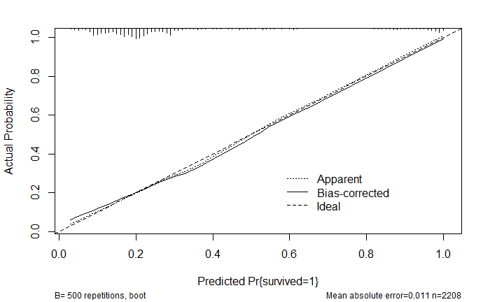

```{r, include = FALSE}
# global chunk options 
knitr::opts_chunk$set(
  warning = FALSE,
  message = FALSE,
  comment = "",
  fig.align = "center",
  echo = FALSE
)

# load libraries 
library(dplyr) # data wrangling
library(ggplot2) # visualization
library(rms) # modeling
library(mice) # imputation for missing data
library(patchwork) # plot composition
library(rpart) # decision tree for missing values
library(scales) # percentage formatting
# latex print option
options(prType='latex')
# load raw data
t <- readr::read_csv("data/titanic.csv") 
# modify Hmisc::latex
mylatex <- function (...) {
    o <- capture.output(latex(...))
    # this will strip /all/ line-only comments
    o <- grep('^%', o, inv=T, value=T)
    cat(o, sep='\n')
}
# theme for ggplot2
ggplot2::theme_set(ymisc::theme_clean())
```


# Introduction 

The sinking of RMS Titanic has brought to numerous machine learning competitions a quintessential dataset among others. The unsinkable British passenger liner in her maiden voyage struck an iceberg on 15 April 1912, and was eventually wrecked. More than 1500 people perished in the great loss. Decades of effort has been devoted to the study the tragic accident, in which one major interest for statistical inquiries is to model and predict the probability of survival given a number of characteristics. 


In recent years the web has witnessed the birth of numerous variants of Titanic data, with one primary source being [Encyclopedia Titanica](https://www.encyclopedia-titanica.org/) [-@hind],  a site started in 1996 as an attempt to tell the story of every person that traveled the Titanic as a passenger or
crew member. This case study grows from the most up-to-date version of the site's data as of October 2020, with the following columns available (table \@ref(data-dictionary)). Source data and steps of data cleaning are elaborated in the [data](#data) section in the appendix. 


```{r, results="asis"}
tribble(
  ~ Variable, ~ Definition, ~ Note,
  "survived", "survival Status", "0 = Lost, 1 = Saved",
  "age", "age", "In years, some infants had fractional values",
  "gender", "gender", "",
  "class", "cabin class", "1st, 2nd, 3rd or crew",
  "joined", "port of embarkation", "Belfast, Cherbourg, Queenstown, Southampton", 
  "nationality", "motherland", "from wiki passenger list",
  "title", "title", "Extracted from name",
  "spouse", "\\# of spouse on board", "",
  "sibling", "\\# of siblings on board", "",
  "parent", "\\# of parents on board", "",
  "children", "\\# of children on board", ""
) %>% 
  mylatex(file = "", 
          table.env = TRUE, label = "data-dictionary", size = "small",
          caption = "Cleaned data with 2208 rows and 11 columns", rowname = NULL, where = "h")
```


The data underlying the whole analysis recorded the survival status `r nrow(t)` Titanic travelers alongside his/her gender, age, companions on board, title, nationality, etc. There were `r (t %>% count(survived))[["n"]][[1]]` victims and `r (t %>% count(survived))[["n"]][[2]]` survivors in total. 

It is essential for every fruitful data analysis task to first identify core questions of investigation that facilitates exploration and interpretation, however vague at the beginning. For our purposes and building on many outstanding works of study [-@gleicher2004survived;-@frey2009surviving;-@symanzikunsinkable], we establish the following research questions. 

\hfill\break


*Question 1*: To which degree is the *women and children first* policy respected? The obvious fact is that significantly higher proportion of females (`r label_percent(0.1)(mean(subset(t, gender == "Female")$survived == 1))`) and children (`r label_percent(0.1)(mean(subset(t, age <= 12)$survived == 1))`) were rescued than males (`r label_percent(0.1)(mean(subset(t, gender == "Male")$survived == 1))`) and adults (`r label_percent(0.1)(mean(subset(t, age > 12)$survived == 1))`). The key question lies in identifying possible factors that might intervene this process. For example, a first class adult male may possess the socio-economic advantage or financial means to get lifeboat access unfairly from the deck crew. The policy can be disrupted in other ways: some Titanic subjects could behave more in line with the selfish *homo oeconomicus*, then people (especially male) in their prime with physical superiority would see higher probability of survival. We are interested to know how gender, age and class were interwoven together to form the resulting Titanic survival pattern. 

*Question 2*: Did crew members fulfill their responsibilities? On the one hand, the `r nrow(subset(t, class=="crew"))` crew of men and women are expected to be more experienced, skilled and better informed about the location of the lifeboats and the incoming danger. On the other hand, their obligations were to care for the safety of passengers first, and only abandon the ship after the task has been fulfilled. We want to know whether self interest dominates in the life-and-death situation and crew tended to look out for themselves, or they have faithfully adhered to their responsibilities. 

*Question 3*: For those who traveled alone with no companion (spouse, sibling, parent, children) on the vessel, is their survival probability greater or less? Those who are unaccompanied could reach a life-saving decision faster without transaction cost and negotiation, yet at the cost of a shortage of psychological and physical support.  Specifically, the effect of having a parent or a child on the ship has been widely studied. The theory of parental investment suggests that women on average invest more in caring for their offspring than males. In times of a disaster,  higher opportunity cost will alert females with offspring more than others, and make them seek more aggressively for changes to secure the children as well as themselves. In statistical terms,  gender-children interaction may exist. 

*Question 4*: Did English passengers receive any special care or given priority to board lifeboats? After all, Titanic was operated by British crew, and managed by British captain, masters and officers that might give preference to compatriots. 


To ensure reproducibility, all the analysis is done in R [@base] with code and text made public in this [repo](https://github.com/enixam/titanic-survival). A brief summary of each section is listed below 

- [Exploration](#exploration). We examine data distribution characteristics, data missing patterns and relative effects leveraging descriptive statistics, followed by redundancy analysis to study dependencies among predictors. Finish with nonparametric loess regression exploring nonlinear trends. 

- [Model development](#dev). The key section in specifying, developing, validating and describing a binary logistic model, split into 

  - [Specification](#spec)  We fit a saturated model with each predictor allowed maximum complexity and nonlinear interactions. This is used to guide development of the final model, based on hypothesis testing and predictor importance ranking with bootstrap. 
  
  - [Multiple imputation](#imputation): We use predictive mean matching to impute subject's age, resulting in 30 complete dataset. 
  
  - [Model fitting and validation](#fit). We fit the final pooled model. Bootstrap internal validation (the ".632" method) is used to study optimism-corrected index measuring discrimination and calibration. 

- [Interpratation and discussion](#interpretation). We describe the model with both graphical methods such as partial effect plots and statistical testing. This provides model-based explanation to address former research problems.  

- [Conclusion](#conclusion). Conclusion and further study.  


# Exploration {#exploratory}

## Descriptive statistics and data processing {#descriptive}

A graphical summary of of the data is given by the `Hmisc::describle` function below. For numerical variables, a inline histogram is produced alongside summary measures such as the number of missing values and the mean. For discrete variables, we focus on the number of categories and their relative frequency.  

```{r, echo = FALSE, results = "asis"}
# print a summary for the data
t %>% 
  describe() %>%
  latex(file = "", size = "small")
```


There are several noteworthy patterns.

Of special importance is the `age` variable, which has roughly 30% missingness. On the other hand, it has a approximately symmetric distribution with 80% of the known observations falling between 14 and 50. For further examination of patterns of missing data, we fit a tree model, explaining when age is missing. 

```{r na-tree, echo = TRUE, fig.cap = "(ref:na-tree)", fig.height = 3.5}
na_tree <- rpart(factor(is.na(age)) ~ ., 
                 data = t %>% mutate(survived = as.factor(survived)) , 
                 minbucket = 50)
# figure 1
rpart.plot::rpart.plot(na_tree, type = 3, cex = 0.6)
```

(ref:na-tree) The decision tree for predicting `is.na(age)`, which finds strong patterns of missing related to class/department and  gender (the Syrian node has very limited samples). Each node shows (top to bottom) if age is predicted to be missing, the predicted probability of missing, the proportion of observations in the node.   


We see in figure \@ref(fig:na-tree) that survival status, gender and class are essential in determining age missingness. Generally, for some third class male passenger or crew, age is most likely to be missing.  For a 3rd class male passenger who did not survive, age is missing with a probability of 60%. Interestingly, English male crew members are much more likely to have missing age than subjects of other nationalities. 


Back to other variables in descriptive statistics. There were nearly twice as many males passengers as females. It is an surprising discovery to me that it wasn't until the late 19th century that the idea of women traveling alone gained ground. The distribution of the number of companions one has on the Titanic tend to be very narrow and concentrated at 0, as illustrated in figure \@ref(fig:skew-rel). Such variables have too little variation to be modeled continuously. Dichotomization into "zero or more" is then motivated since the analyst will not lose too much information. 


```{r skew-rel, fig.cap = "(ref:skew-rel)", fig.height = 3, fig.width = 5, fig.pos = "h", out.extra = ""}
t %>%
  tidyr::pivot_longer(8:11, names_to = "relation", values_to = "n") %>%
  ggplot() + 
  geom_bar(aes(n), color = "black", fill = "midnightblue", alpha = 0.7) +
  facet_wrap(~ relation, nrow = 1) + 
  labs(x = NULL, y = NULL) 
```

(ref:skew-rel) Few subjects have more than one companion in any of the 4 relations.


```{r}
t$spouse <- if_else(t$spouse == 0, "0", "1")
t$parent <- if_else(t$parent == 0, "0", "1")
t$sibling <- if_else(t$sibling == 0, "0", "1")
t$children <- if_else(t$children == 0, "0", "1")
```

For each predictor, figure \@ref(fig:univariate) displays the survival percentage in the observations for different categories (or cutpoints). This is a univariate graph with no control over confounding variables, though it may still assist us in determining how to spend degrees of freedom. If a predictor's effect on the response is strong, it's more likely that we need to spend more parameters on it. However, if a variable's effect appears to be weak, it could either due to a truly flat relationship, or to a nonlinear effect. 

```{r univariate, fig.height = 7.5, fig.width  = 3.5, fig.cap = "Univariate summary of relationship between survival and each predictor"}
s <- summary(survived ~ ., 
    data = t)
plot(s, main = "" , subtitles = TRUE, cex = 0.65, pch = 22, width = 3)
```

The plot reveals appreciably strong effects of gender and cabin class on survival status. Age effects seem trivial except for the subjects with missing entry, but again, the downside of the univariate graph of this sort is that it forces the audience to think linearly, and only after categorization.  By the same token effects of other variables cannot be determined. 

We finish with a redundancy analysis to study if data reduction of removing unnecessary predictors is possible. The checking algorithm expands continuous predictors into cubic splines and categorical predictors into dummy variables, it then uses OLS to predict each predictor with all remaining predictors. A predictor is deemed "redundant" if it can be predicted with an $R^2$ greater than 0.9. 

```{r, comment = ""}
redun(~ age  + gender + class +  nationality + title + spouse +
        sibling + parent + children
      , data = t)
```

The redundancy analysis has reported `title` as redundant, with more than 97% of its variation explained by the rest of the predictors. It is not surprising that knowing a person' age could almost determine his/her title in the four categories. This means including `title` contains nearly no predictive value and could be readily deleted. 

```{r, echo = TRUE}
t$title <- NULL
```


## Loess regression for nonlinear pattern 

```{r loess-curve, fig.height = 7.5, fig.cap = "(ref:loess-curve)"}
p1 <- ggplot(t, aes(age, survived)) +
  histSpikeg(survived ~ age, lowess = TRUE, data = t) + 
  scale_y_continuous(labels = scales::label_percent()) +
  labs(y = NULL, x = NULL)
p2 <- ggplot(t, aes(age, survived, color = gender)) + 
  histSpikeg(survived ~ age + gender, lowess = TRUE, data = t) + 
  scale_y_continuous(labels = scales::label_percent()) +
  labs(y = NULL, x = NULL)
p3 <- ggplot(t, aes(age, survived, color = class)) + 
  histSpikeg(survived ~ age +  class + gender, lowess = TRUE, data = t) + 
  scale_y_continuous(labels = scales::label_percent()) +
  labs(y = NULL) + 
  facet_wrap(~ gender) + 
  theme(legend.position = "bottom")
(p1 + p2) / p3 
```


(ref:loess-curve) loess estimates of $P(\text{survived})$, with tick marks representing frequency counts within equal-width bins. Top left panel indicates nonlinear age effect without controlling other factors. Other plots give estimates under stratification by sex and class. The top right plot reflects women have a higher survival probability in general, and older females (red) and younger males (blue) are most likely to survive in their respective gender group. Two bottom plots depict survival pattern of subjects from different cabin class condition on sex.

The loess method is a common nonparametric regression model to study nonlinear relationship. In the case of binary response, the fitted value at $x = x_0$ is the weighted proportion of positive cases near the neighborhood of $x_0$. If a loess curve exhibits a reasonable degree of nonmonotonicity, it will often pay to not assume linearity, e.g., modeling the predictor with polynomial transformation or with splines. For this reason, we can model age against survival status with loess regression to avoid linear assumption. 

It was also widely studied that gender interacted directly with age, in other words, age effects for men and women are most likely to be nonparallel in the logit scale. Another prominent joint effect, according to many follow up studies, happened between age and cabin class. Figure \@ref(fig:loess-curve) displays loess estimates of survival probability given age under certain stratification. Not only in a powerful nonlinear fashion does age affect survival status (top left panel), we also observe it interact with other two factors in a nonlinear way. Despite that the loess estimation here would by no means serve as a strict inference-oriented model, and we only include 3 factors at this point, it inspires a treatment of these effects that is more cautious and thorough. We shall assume complexities such as nonlinearity and interaction, rather than a linear main effects model. 


# Model development {#dev}

A typical modeling workflow begins with an choice of a statistical model or a machine learning model. A statistical model often stems from a hypothesized probabilistic data generating mechanism y, whereas machine learning models are algorithmatic in nature, optimized with parameter tuning. We choose to develop a statistical model, a "simple" binary logistic regression, for the following reasons. 

We prefer probabilistic predictions to classification with output label 0 and 1, for the emphasis placed upon the *tendency* of survival. The value of modeling consists not in a dichotomous classification, but in what characteristics would increase or decrease the probability of survival. This notion has ruled out most of the machine learning models for classification, say, random forest, support vector machines and neural network, which are not intrinsically probability oriented. Such classifiers can often only yield a forced choice. 

Interpretability and inference matters. Many top data science competitions have reported moderately high signal to noise ratio (e.g., 90% prediction accuracy) that might tip the balance towards machine learning models, yet interpretability is harmed. Specifically, statistical models favours additivity and explicit specification. It follows that there are natural distinctions between main effects and interactions, linearity and nonlinearity. And the inference procedure is well defined provided that the model is correctly specified. While in a multi-layer neural network, everything can interact with one another and it could be daunting to isolate effects and conduct inference. 

Machine learning models are data hungry and sometimes create the need for big data [@van2014modern]. To guard against overfitting, the analyst has to have a sample size that is 10 times larger at least if he chooses a tree model instead of regression. While this case study uses a Titanic dataset that is about 1/3 larger than those only concerned with passengers, it is far less sufficient for a typical data-hungry machine learning model to validate well. The rationale is that a statistical model is a safter approach that can do without big data,  as Dr. Harrell commented

> If n is too small to do something simple, it is too small to do something complex. 


## Specification {#spec}

We start by fitting a relatively large model, to decide how model complexity should be properly represented. This includes deciding the number of knots for continuous predictors and the number of categories of categorical predictors, could we remove some term, where should we place interaction, etc. This strategy as a starting point is also called prespecification of predictor complexity. It avoids creating phantom degrees of freedom when one has subjective judgment according to scatter diagrams or descriptive statistics on how to represent variables in a model. Commonly done, for example, is excluding a quadratic term simply because it is "non-significant", with p-value on the edge of $0.05$. This approach is known to distort coefficient estimates, confidence intervals, p-value  and calibration (too optimistic) of the final model,  because it fails to accounts for sampling variability and suffers selection bias.[@grambsch1991effects]^[confidence interval too narrow, p-value and standard errors too small and calibration too optimistic] Therefore, it is essential to have extra caution, as demonstrated below using resampling, to do model simplification. 

Prespecification of predictor complexity is done first by developing a saturated logistic model and then making necessary adjustments and improvements. In this model, we grant age effect maximnum flexibility represented as natural splines with 5 knots, and all categorical predictors retain their original categories without pooling. Two way interactions have been specified between age and gender, age and class, age and parent, and gender and children. Since this is an initial model, observations with missing age are not used. The model equation is ^[`rcs(x, n)` means "represent predictor x using natural splines with n knots". Knots are placed on evenly space percentiles by default.]

```{r}
dd <- datadist(t)
options(datadist = "dd")
f1 <- lrm(survived ~ (rcs(age, 5) + gender + class)^2 +
            (rcs(age, 5) * parent) + (gender * children) + 
            spouse + sibling + 
            joined + nationality,
          data = t, x = TRUE, y = TRUE)
```


```r
survived ~ (rcs(age, 5) + gender + class)^2 + (rcs(age, 5) * parent) + 
            gender * children + joined + spouse + sibling + nationality 
```

```{r, results="asis"}
mylatex(anova(f1), file="", size = "small", table.env = TRUE, caption = "Hypothesis testing for the saturated model", label = "fone-anova", where = "h")
```


Table \@ref(fone-anova) selects specific hypothesis to test for general power, linearity and additivity assumptions of individual predictors, as well as their "chunky" version of global effects. We see dominant main effects of gender, age and cabin class, be it linear or nonlinear ($p < 0.0001$). Equally notable are the strong nonlinear interaction terms between the three variables. Of all four companion variables only parent manifests clear predictive ability. The impact of embarkation point is somewhat ambiguous ($p = 0.14$). As a graphical illustration, figure \@ref(fig:fone-anova-plot) plots "adjusted" partial $\chi^2$ statistic of each predictor in the saturated model, with correction for degrees of freedom allocated to them.^[The correction is done by subtracting the d.f. from the partial $\chi^2$ statistic, its expected value under the null hypothesis.] This adjustment levels the playing field for comparison of predictive ability. The larger the adjusted $\chi^2$, the more likely a variable would have a non-flat impact on survival status.  

```{r fone-anova-plot, fig.cap = "(ref:fone-anova-plot)", fig.height = 4.5, fig.width = 5.5,fig.pos = "h", out.extra=""}
plot(anova(f1), cex = 0.8)
```
(ref:fone-anova-plot) Ranking of predictive power in the saturated model based on adjusted $\chi^2$ 

```{r, include = FALSE, cache = TRUE, eval = FALSE}
# previously used to study predictor's importance with backward selection
# set.seed(2021)
# v1 <- validate(f1, B = 500, bw = TRUE)
```


```{r, cache = TRUE, include = FALSE}
set.seed(2021)
n <- nrow(t)
B <- 500
ranks <- matrix(NA, nrow = B, ncol = 14)
rank_vars <- function(fit) {
  rank(plot(anova(fit), sort = "none", pl = FALSE))
}

Rank <- rank_vars(f1)
for (i in 1:B) {
  j <- sample(n, replace = TRUE)
  fit_boot <- try(update(f1, data = t, subset = j), silent = TRUE)
  if ("try-error" %in% class(fit_boot)) {
    next
  } else if (!fit_boot$fail) {
    ranks[i, ] <- rank_vars(fit_boot)
  }
}
```

```{r predictor-ranking, fig.cap = "(ref:ranking)"}
colnames(ranks) <- names(Rank)
library(ggridges)
ranks %>% 
  as_tibble() %>% 
  na.omit() %>%
  tidyr::pivot_longer(everything(), names_to = "predictor", values_to = "rank") %>% 
  mutate(group = factor(predictor, levels = names(Rank))) %>% 
  ggplot(aes(rank, group, group = group)) + 
  geom_density_ridges2(aes(fill = group), stat = "binline", binwidth = 1) +
  scale_fill_cyclical(values = c("#0000B0", "#7070D0")) +
  geom_text(aes(y = group + 0.95*after_stat(count/max(count)), 
                label = ifelse(after_stat(count) >= 40, after_stat(count), "")), 
            stat = "bin", color = "white", size = 3) + 
  labs(y = NULL, x = NULL) + 
  theme_ridges() + 
  theme(axis.title.x = element_text(hjust =  0.5)) + 
  scale_x_continuous(breaks = 1:13) + 
  scale_y_discrete(expand = c(0, 0))  + 
  theme(axis.text.y = element_text(size = 10),
        axis.text.x = element_text(size = 9))
```

(ref:ranking) Distribution of importance ranking over `r nrow(ranks[!is.na(ranks[, 1]), ])` bootstrap resamples. Text annotation indicates the number of times a term has a specific ranking, when the term ranked more than 40 times at that position. For example, gender ranks 13 (the most important) in all resamples.  


As mentioned before, the goal of the saturated model is to guide the arrangement model complexity. More specifically, should we allocate more degrees of freedom to a certain term because some complex effects has been underrepresented? Or is there a term that is highly irrelevant thus could be deleted? The polynomial transformation on age and the resulting nonlinear interaction carry substantial statistical power, while further increasing knots or creating high-order interactions causes numerical problems. Therefore, it is positive advantage to us to keep them as is. There are also not sufficient reasons to collapse levels for nationality and port.  Binary variables such as spouse and sibling have extremely large p-values ($p > 0.5$), indicating relatively small predictive power. Still,  great care should be taken when one attempts to conduct aggressive model simplification based on hypothesis testing and p-values. A reliable way is using bootstrap resampling. Figure \@ref(fig:predictor-ranking) studies the importance of all terms including main effects and interaction over `r nrow(ranks[!is.na(ranks[, 1]), ])` bootstrap resamples. In each resample, we fit the saturated model, rank all 13 terms by the adjusted statistic $\chi^2 - \text{d.f.}$ in ascending order so that 13 is most important and 1 is least important. The height of a bar indicates the number of times a term is ranked at that position. 


The importance ranking echoes previous findings that gender, age and classes are predominant factors. It also reveals great variability in terms of assessing predictive power. For example, we are only confident that `joined` is not one of the 5 most influential predictors. Nonetheless, rankings of the aforementioned "weak" variables, sibling and spouse, are highly concentrated at 1 to 3.  In fact, if we perform backward selection in nearly 400 bootstrap resamples with AIC as stopping rule, none of the 2 binary variables entered the selected model more than 20 times. These corroborating evidence, combined with p-values,  lead to the final decision of removing them in the final model. 

```{r, echo = TRUE}
t$sibling <- NULL
t$spouse <- NULL
```


## Multiple imputation {#imputation}


```{r, cache = TRUE, echo = TRUE}
# multiple imputation with predictive mean matching to generate 30 complete dataset
imp <- mice(t, method = "pmm", m = 30, printFlag = FALSE)
```

```{r, fig.width = 5, fig.height = 3, fig.cap = "Density plot of observed and imputed data. In general, the imputed dataset mimic the age distribution seen in the observed data."}
densityplot(imp)
```

The last step before fitting the final model is imputing missing values for age. The goal of multiple imputation, in contrast to simple alternatives such as filling in conditional mean, is to provide an accurate estimate of the variance-covariance matrix that not only accounts for sampling variability, but also for the extra variance caused by missing values and finite number of imputations [@van2018flexible]. Thus tests on individual parameters gain power and bias are reduced. The general idea is to generate multiple complete dataset, fit the model in parallel, and then obtain a pooled final estimate by averaging over all fitted models. 
 

We use predictive mean matching with $m = 30$, since approximately 30% of age is missing. The nonparametric method selects a group of Titanic subjects from all complete cases that have predicted values closest to the predicted value for the subject with missing age. ^[The predicted value is generated by fitting a linear main effect model conditional on all other variables.] One donor is randomly drawn from the candidates, and the observed age of the donor is taken to replace the missing value. We use the default "type 1 matching" and 5 donors (@van2018flexible, Section 3.4.2). Advantages of predictive mean matching in the Titanic age setting are manifold. Since imputations are based on values observed elsewhere, they are realistic (e.g., no negative age). For another, it is compatible with non-normaility which allows us to have fewer assumptions. 


## Model fitting, validation and calibration {#fit}

We now fit the final logistic model across 30 complete dataset. Pooled estimates are obtained by averaging over all pieces. We also get an imputation-corrected variance–covariance matrix based on within– and between–imputation variances. The long table of Individual estimates are in the [appendix](#formula). 
```{r, include = FALSE, cache = TRUE}
f2 <- fit.mult.impute(survived ~ (rcs(age, 5) + gender + class)^2 +
            rcs(age, 5) * parent + gender * children + nationality + joined,
            fitter = lrm, 
            imp, 
            data = t)
```


The model exhibits moderate discrimination power, e.g. the ability to separate perished and survived subjects (concordance probability $=$ area under the ROC curve $\approx 0.81$).  Brier score, as a proper quadratic scoring rule that incorporate both aspects, is a promising $0.144$. 


<!-- Produced as part of print(f2) -->


\begin{center}\small
\begin{tabular}{|c|c|c|c|}\hline
&Model Likelihood&Discrimination&Rank Discrim.\\
&Ratio Test&Indexes&Indexes\\\hline
Obs~\hfill 2208&LR $\chi^{2}$~\hfill 787.09&$R^{2}$~\hfill 0.419&$C$~\hfill 0.814\\
~~0~\hfill 1496&d.f.~\hfill 43&$g$~\hfill 1.789&$D_{xy}$~\hfill 0.627\\
~~1~\hfill 712&Pr$(>\chi^{2})$~\hfill \textless 0.0001&$g_{r}$~\hfill 5.993&$\gamma$~\hfill 0.629\\
$\max|\frac{\partial\log L}{\partial \beta}|$~\hfill 0.02&&$g_{p}$~\hfill 0.274&$\tau_{a}$~\hfill 0.274\\
&&Brier~\hfill 0.144&\\
\hline
\end{tabular}
\end{center}


```{r, results = "asis"}
mylatex(anova(f2), file = "", size = "small", table.env = TRUE, label = "ftwo-anova",
        caption = "Hypothesis testing for the final model", where = "h")
```


Table \@ref(ftwo-anova) again constructs meaningful hypothesis testing for the final model. The $\chi^2$ statistic of age decreases by a minor amount, resulting from using patterns of association with survival status to impute missing age. Remaining predictors generally have larger $\chi^2$ statistic and smaller p-value compared to the saturated model in table \@ref(fone-anova), due to larger sample size in model development.


```{r, include = FALSE, cache = TRUE}
f2 <- update(f2, x = TRUE, y = TRUE)
v2 <- validate(f2, B = 500, method = ".632")
```

```{r, results = "asis", eval = FALSE}
# not evaluated for formatting issues
# produce the following table
mylatex(v2, file = "", size = "small", table.env = TRUE,
        label = "model-val", caption = "Optimism-corrected metrics", where = "h")
```


\begin{table}[h]
\caption{Optimism-corrected metrics\label{model-val}} 
\begin{center}\small
\begin{tabular}{lrrrrrr}
\hline\hline
\multicolumn{1}{l}{Index}&\multicolumn{1}{c}{Original}&\multicolumn{1}{c}{Training}&\multicolumn{1}{c}{Test}&\multicolumn{1}{c}{Optimism}&\multicolumn{1}{c}{Corrected}&\multicolumn{1}{c}{$n$}\tabularnewline
&\multicolumn{1}{c}{{\small Sample}}&\multicolumn{1}{c}{{\small Sample}}&\multicolumn{1}{c}{{\small Sample}}&&\multicolumn{1}{c}{{\small Index}}&\tabularnewline
\hline
$D_{xy}$&$ 0.6253$&$ 0.6416$&$ 0.5599$&$ 0.0413$&$ 0.5840$&$489$\tabularnewline
$R^{2}$&$ 0.4190$&$ 0.4374$&$ 0.3077$&$ 0.0703$&$ 0.3487$&$489$\tabularnewline
Intercept&$ 0.0000$&$ 0.0000$&$-0.2598$&$ 0.1642$&$-0.1642$&$489$\tabularnewline
Slope&$ 1.0000$&$ 1.0000$&$ 0.6726$&$ 0.2069$&$ 0.7931$&$489$\tabularnewline
$E_{\max}$&$ 0.0000$&$ 0.0000$&$ 0.0819$&$ 0.0819$&$ 0.0819$&$489$\tabularnewline
$D$&$ 0.3560$&$ 0.3753$&$ 0.2526$&$ 0.0653$&$ 0.2907$&$489$\tabularnewline
$U$&$-0.0009$&$-0.0009$&$    Inf$&$   -Inf$&$    Inf$&$489$\tabularnewline
$Q$&$ 0.3569$&$ 0.3762$&$   -Inf$&$    Inf$&$   -Inf$&$489$\tabularnewline
$B$&$ 0.1435$&$ 0.1407$&$ 0.1496$&$-0.0039$&$ 0.1474$&$489$\tabularnewline
$g$&$ 1.7895$&$ 2.0282$&$ 1.3646$&$ 0.2685$&$ 1.5210$&$489$\tabularnewline
$g_{p}$&$ 0.2742$&$ 0.2812$&$ 0.2164$&$ 0.0365$&$ 0.2376$&$489$\tabularnewline
\hline
\end{tabular}
\end{center}
\end{table}


Although there will not be a second Titanic, making prediction a lesser problem, validation can still be used for good purposes. It quantifies the degree of overfitting by presenting unbiased, optimism-corrected metrics. More accurately, we will be using bootstrap internal validation to study the "future" performance of the model. In an award-winning solution to this legendary dataset submitted by IBM Watson, a holdout test set was used to validate their model. The data-splitting approach is known to require a significantly larger sample size ($> 20000$) than resampling methods on average to work acceptably well [@splitval]. Moreover, when the model developed on training sample is validated, the researcher would recombine training and testing set to fit a full model. This model, however, is never validated. 

```{r, cache = TRUE, include = FALSE, eval = FALSE}
cal <- calibrate(f2, B = 500)
```


```{r, cal-curve, fig.cap = "(ref:cal-curve)", out.width = "90%"}

```

As an improved alternative, we choose Efron's 0.632 method for bootstrap internal validation. In each of the 494 bootstrap resamples, a logistic model is developed and evaluated on observations omitted from bootstrap samples. Per-bootstrap optimism is then the apparent index of accuracy subtracting that in the test sample formed by omitted observations. An weighted average $\hat{\varepsilon}_0$ over all 494 bootstrap resamples is computed to estimate the true optimism, while the bias-corrected
estimate of predictive accuracy is calculated as $0.632(\text{apparent accuracy} - \hat{\varepsilon}_0)$. Table \@ref(model-val) displays the results. It validates two general aspects of model accuracy, discrimination and calibration. Calibration is the ability to make unbiased estimates of survival status, while discrimination is a measure in how separated predictions are for survivors and victims. 


(ref:cal-curve) Bias-corrected calibration curve from internal bootstrap validation. Predictions output by the final model are plotted against estimated actual probabilities with loess. Bars on the top indicates number of observations in the same prediction bin. The bias corrected line is close to the ideal 45 degree line

The output does not deviate much from the apparent index. The validated area under the ROC curve as well as the concordance probability is now `r round((v2["Dxy", "index.corrected"]/2)+0.5, 2)`, and pseudo $R^2$ 0.35.  This indicates certain shortage of discrimination ability in comparison to some published models on the older dataset. $\text{Slope} = 0.8$ signals small amount of overfitting, with coefficients shrinking by 20% on new data.^[$D_{xy} = 2(\text{concordance proabability - 0.5})$]. Brier score is now near 0.15. 


Discrimination index are often associated with rank correlations between predictions and response, thus may not be sensitive enough to evaluate their closeness. Figure \@ref(fig:cal-curve) aims to gauge the concordance between predicted values and observed data, or in other words, calibration. The actual probability is estimated with loess regression, and the bias correction is computed in a similar way as in table \@ref(model-val). The 45 degree line indicates the ideal scenario in which prediction perfectly matches observation. The model is well-calibrated by and large, with slight departure from the straight line in central region where there were few observations. The mean squared error is 0.00018, and the 0.9 quantile of absolute error
is 0.023. Similarly, the unreliability index $E_{max} =$ `r round(v2["Emax", "index.corrected"], 2)` measures maximum error in predicted probabilities. All these metrics reflect strong calibration. 

To sum up, the model presents reasonable discrimination power and satisfactory quality of fitting. Excellent performance in calibration lifts overall metrics such as Brier score.


# Interpretation and discussion {#interpretation}


With non-monotonic relations and interactions involved, interpretations built upon parameter estimates or interquartile-range odds ratios are rarely informative. In this case, the model can be effectively described by partial effects plots, where we plot each characteristics against $\hat{P}(\text{survived})$ while holding other predictors constant at mean or median for continuous variables and mode for categorical variables. When interactions are involved, the survival probability are estimated separately for various levels of the interacting factors. For categorical predictors, level-specific effects are computed comparing to a reference category.


Figure \@ref(fig:partial-age-sex-cabin) is an example partial effect plot for age under stratification of sex and cabin class. 

```{r partial-age-sex-cabin, fig.cap = "(ref:partial-age-sex-cabin)", fig.height = 3.5, fig.pos = "H", out.extra = ""}
ggplot(Predict(f2, age, gender, class = c("1st", "2nd", "3rd"), 
               fun = plogis), 
       legend.position = "none",
       adj.subtitle = FALSE, 
       colorscale = function(...) scale_color_manual(values = c("blue", "orange"))) +
  scale_y_continuous(labels = scales::label_percent()) + 
  labs(x = NULL)
```

(ref:partial-age-sex-cabin) Age effects on survival status for \color{blue} \textbf{female} \color{black} and \color{orange} \textbf{male} \color{black}, stratified by cabin class. The default control setting is parent $=$ 0, children $=$ 0, nationality $=$ English, and port $=$ Southampton. Shaded region are 95% confidence interval. 

We now address research questions invited in [Introduction](#introduction).

\hfill\break

*Question 1*: Study the effects of the *women and children first policy*, with focus on gender, age and classes. 


Women and children are evacuated first on average, as mentioned before using total proportion. The model helps us bring into considerations possibly intervening factors that could distort the established order of lifeboat access.  There was recollection that at the beginning of the sinking,  the Second Officer  on the Titanic suggested to Captain Smith, "Hadn't we better get the women and children into the boats, sir?", to which the captain responded: "put the women and children in and lower away".  Fifth Officer Harold Lowe in the American Inquiry as reinforced this policy as one regardless of classes

> It was simply the first woman, whether first class, second class, third class, or sixty-seventh class. It was all the same; women and children were first. 
 
As we shift the emphasis away from total numbers and the average,  particularly after taking a closer look at numbers under stratification, another story presents itself. To begin with, not all classes of women and children received the same level of help during the sinking, whether intended or unintended. We observe that first class passengers have the highest predicted survival possibility in general, and the third class being the lowest. The chasm between classes is most manifest in adult women. A 30-year-old first class women is likely to survive with a likelihood between `r label_percent(0.1)(Predict(f2, age = 30, class = "1st", gender = "Female", fun = plogis)$lower)` and `r label_percent(0.1)(Predict(f2, age = 30, class = "1st", gender = "Female", fun = plogis)$upper)`), and had she been in the third class, `r label_percent(0.1)(Predict(f2, age = 30, class = "3rd", gender = "Female", fun = plogis)$lower)` and `r label_percent(0.1)(Predict(f2, age = 30, class = "3rd", gender = "Female", fun = plogis)$upper)`. For children, knowing a 12-year-old comes from the first class increases the upper bound of predicted survival probability by nearly 30%. The most decisive explanation is that first-class passengers had better access to information about the
imminent danger and were aware that the lifeboats were located close to the first class cabins. Thus, their marginal effort costs to survive were lower.  Only 4 first class women did not survive, and at least two of them stayed on the ship voluntarily. In contrast, most third-class passengers were located at the quarters down the stern, from which the designer deliberately made it difficult to reach the upper decks. 

While the first class is used to exemplify the uneven treatments of different classes, the policy was severely undermined within the third class after removing class effects. But let us first take the second class as a reference group, where the prediction roughly matches what should happen if children and women received the asserted assistance
on the part of the authorities. The likelihood of survival for both gender starts approximately at the same level, then the probability for male plunged as he ages, while female only see a minor decrease after leaving the "girl" range. In the observations children were saved 100% (24 out of 24) and 88.7% of the women were rescued (94 out of 106). 

The third class deviates from the reference group in two main ways.  Firstly, people in their prime have higher predicted survival probability. The survival curve displays an inverted U-shape, where people aged between 20 and 30 are mostly likely to survive, for both men and women. Secondly, the estimated gender gap in survival probability narrows drastically for third class. For example, being an 28-year-old man in the third class increases survival probability by 10% compared to the second class on average, whereas for a female age-mate the third class makes her 33% more unlikely to survive. In addition, third class children had a slight 6% advantage in survival rates over adults, whereas in the other 3 groups, this disparity rose to 56%.

In summary, women and children first was only true on average, it was a not a class-blind effort, and third class women and children were faced with an extra harsh situation. 


\hfill\break

*Question 2*: Are crew members driven more by self interests or by responsibilities during the sinking? 

In age ranges where we have relatively large sample (between 20 and 40), crew members have a survival pattern very skin to that of the first class passengers (left panel of figure \@ref(fig:partial-age-crew)). Females are predicted to survive with a probability `r label_percent(0.1)(mean(Predict(f2, age = seq(20, 40), gender = "Female", class = "crew", fun = plogis)$yhat))`. In contrast, the mean survival probability female between 20 and 40 in first, second and third class passengers are `r label_percent(0.1)(mean(Predict(f2, age = seq(20, 40), gender = "Female", class = "1st", fun = plogis)$yhat))`, `r label_percent(0.1)(mean(Predict(f2, age = seq(20, 40), gender = "Female", class = "2nd", fun = plogis)$yhat))`, `r label_percent(0.1)(mean(Predict(f2, age = seq(20, 40), gender = "Female", class = "3rd", fun = plogis)$yhat))`. When it comes to males, the relative magnitude is the same. The right panel of figure \@ref(fig:partial-age-crew) confirms that crew members were generally the group with the second largest estimated survival probability. This was not necessarily caused by negligence, but their advantages in informational and relational resources is evident. 

We cannot form a definitive answer as to whether the majority of the crew had fulfilled their responsibilities. There were, though, analysis pointing out that the crew failed to direct the some three to four hundred third class passengers who were heading toward the stern for safety [@gleicher2004survived]. There they had a false sense of assurance because  water was coming in from the bow at that time. Various stewards encouraged the group to make their journey to the stern. This eventually resulted in a cut-off from the rescue effort. 


```{r, cache = TRUE}
age <- Predict(f2, age, gender, class = "crew", 
             fun = plogis)$age
a <- age[age >= 20 & age <= 40]

age_compare <- tibble(age = a, 
       crew = Predict(f2, age = a, class = "crew", fun = plogis)$yhat,
       first = Predict(f2, age = a,  class = "1st", fun = plogis)$yhat,
       second = Predict(f2, age = a, class = "2nd", fun = plogis)$yhat,
       third = Predict(f2, age = a, class = "3rd", fun = plogis)$yhat) %>% 
  tidyr::pivot_longer(-1, names_to = "class", values_to = "prob")
```


```{r partial-age-crew, fig.cap = "(ref:partial-age-crew)", fig.height = 3, fig.width = 5.5, fig.pos="h", out.extra=""}
p1 <- ggplot(Predict(f2, age, gender, class = "crew", 
               fun = plogis), 
       legend.position = "none",
       adj.subtitle = FALSE, 
       colorscale = function(...) scale_color_manual(values = c("blue", "orange"))) + 
  scale_y_continuous(labels = scales::label_percent()) +   
  labs(x = NULL, y = NULL)

p2 <- age_compare %>%
  ggplot(aes(age, prob, color = class, group = class)) +
  geom_line() + 
  theme(legend.position = "none") + 
  scale_y_continuous(labels = scales::label_percent()) + 
  labs(x = NULL, y = NULL) + 
  gghighlight::gghighlight(TRUE, label_params = list(label.size = NA))

p1 + p2
```

(ref:partial-age-crew) Left: partial effects of age for crew members. Right: comparing estimated survival probability of crew members to passengers when $20 \le\text{age} \le 40$. 

\hfill\break

*Question 3*: Did those traveling with at least one companion have a higher survival probability than those traveling alone? 

Subjects having at least one parent with them clearly have better chances in surviving ($p = 0.01$), while effects of having child or children is on the verge of significance $p = 0.06$. Their relative influence in increasing the mean survival likelihood is analogous, both translating into a estimated 6% rise.   

We do not see significant joint effects between age and parent, and gender and children. This means parents influences survival chance of babies, teenagers and adults alike. And the gender distinction in caring for the next generation is not manifest on the ship. 

The other two types of companions, sibling and spouse, were ruled out from due to their low explanatory value. 


\hfill\break

*Question 4*: Did British passengers gain survival advantage for some reason (e.g., activated national tie or simply because they could understand the instructions)?     

Nationality is highly insignificant in the final model ($p = 0.58$). People from different nations have almost identical survival pattern in the same class (figure \@ref(fig:partial-nationality). One explanation, according to the titanica forum,  is that the crew's instructions in English tended to be along the lines of "Wait down here for further orders", and a lack of understanding might even help. 

```{r partial-nationality, fig.cap = "Partial effects of nationality on predicted survival probability. ", fig.height = 3, fig.pos = "H", out.extra = ""}
ggplot(Predict(f2, nationality, fun = plogis, class = c("1st", "2nd", "3rd")),   
       anova = anova(f2), size.anova = 3, adj.subtitle = FALSE) + 
  labs(x = NULL)
```
Another explanation why the ability to speak or at least understand English might not be an edge, is that many immigrants in third class were traveling in family or neighborhood groups which included at least one English-speaker (often an established immigrant returning to the US from a visit back home) who could act as their spokesperson.

\hfill\break


Our last discovery concerns embarkation point. Passengers came aboard at Cherbourg totaled 271, and had a surprisingly higher marginal survival rate of over 50%. The predicted survival probability is about 10% higher at Cherbourg than the average. The other two non-reference locations (Southampton and Queenstown) did not observe significant difference ($p = 0.9$ and $0.75$). 


```{r partial-port, fig.cap = "Partial effects of port on predicted survival probability", fig.height = 3, fig.pos = "H", out.extra = ""}
ggplot(Predict(f2, joined,
               fun = plogis), 
       anova = anova(f2), pval = TRUE, size.anova = 3, adj.subtitle = FALSE) + 
  labs(x = NULL, y = NULL)
```

I have much confusion about this peculiar role of embarkation. One relevant point I found lately is that the Cherbourg list of passengers vanished long ago, according to a famous Titanic tract *Who Sailed on Titanic*, by Debbie Beavis. Getting the number of passengers on that port is difficult, not to mention the exact list of who went on which ship. Though it is still hard to imagine why Cherbourg could almost shoulder the entire $\chi^2$ statistic for `joined`, even with the presence of some amount of incorrectness. 


# Conclusion 


When all is said and done we detach ourselves from these fixed questions, and have a quick overall examination on all factors in figure \@ref(fig:ftwo-anova-plot). We identify gender, class and age as the top 3 most powerful determinants of survival status. Traveling with a parent and boarding the ship at Cherbourg (mysteriously) also increases survival probability. 

We found that complex class factors exists in the overt preference to rescue women and children first. First Class woman had a significantly greater likelihood of survival than either a woman from the second or third Class. Also, the difference in survival likelihood between male and female were much reduced in the third class.  

```{r ftwo-anova-plot, fig.height = 3.5, fig.width = 5, fig.cap = "(ref:ftwo-anova-plot)", fig.pos = "H", out.extra = ""}
plot(anova(f2), cex = 0.75)
```

(ref:ftwo-anova-plot) Ranking of predictive power in the final model based on adjusted $\chi^2$ 


This short analysis leaves room for improvement in several ways, not the least of which is model specification. Flexibility (more knots on age, higher order and more interactions) is sacrificed in exchange for a workable fit without numerical problems. I also have to give up valuable information like fare in the model, as I have not figured a reasonable way to study its effect with one third of the subjects being crew members. It may also also be informative to split the crew into groups of different responsibilities, e.g., officers, deck and engine crews, victualing, restaurant staff. These working groups differ in comparative information advantage and authority, which affects survival rate. Another crucial yet missing determinant is the location of cabin, which is directly related to lifeboat access. Regrettably the probe into living details on the Titanic are often ambiguous and thus qualitative. 


\pagebreak


# (APPENDIX) Appendix {-} 


This case study has been greatly inspired by Dr. Frank Harrell's similar example in his *Regression Modeling Strategies* [-@harrell2015regression Chapter 12] book, here I attempt to propose my understanding and interpretation of model development that is as original as possible.

# Data

A variety of other versions and forms of Titanic data sources have been collected due to public's constant interests in the tragedy as well as modern efforts trying to unveil the mystery. A comprehensive overview of several data variants is given by @symanzikunsinkable. Data in this case study is accessed on [Encyclopedia Titanica](https://www.encyclopedia-titanica.org/), a leading archive on titanic facts.  In contrast to the the famous titanic dataset (known as `titanic3`) distributed by [kaggle](kaggle.com) for introductory level machine learning practices, the case study uses a more up-to-date and complete dataset in the following ways

- Larger sample size. Our data includes crew and staff members alongside passengers, while titanic3 only incorporate passenger information. We do not use a separate test set approach for validation either. As a result, the sample size is about 2.5 times larger. 

- More variables. Additional columns such as role on the ship, nationality and occupation are added. A major difference is made by separating the travel companion data into four distinct columns: number of parents, children, sibling and spouses that each passenger traveled with. These were combined into two columns before. 

- Improved accuracy. `titanic3` was an effort to study Titanic in the 20th century, lastly updated and improved by Thomas Cason in 1999. During the recent two decades the data has been constantly revised, many errors corrected, many missing ages filled in, and new variables created. Now it reflects our our most up-to-date understanding of the event, in the digital form, as of 21 October 2020. 

The data cleaning process involves converting data types, creating new features, adjusting levels for categorical variable and excluding irrelevant columns. Code can be found at [clean.R](https://github.com/enixam/titanic-survival/blob/master/clean.R).

`title` is extracted through each person's name with regular expressions and then collapsed into 4 levels.^[For example, the title for passenger "Abbing, Mr Anthony" is "Mr".] This is a predictor that has been widely reported to have good predictive ability in many submissions. However, as we see in the redundancy analysis at the end of Section \@ref(descriptive), it should not even be accepted in the tentative, saturated model. 

Passengers are classified according to their cabin class. Crew includes victualling crew^[crew in charge of food, housekeeping, laundry, room service, etc.], engineering crew, deck crew and officers, substitute crew, guarantee group, restaurant staff and orchestra. 

Rare nationality (lower than 50 people) is collapsed. 

Age information is presented as non-missing on the surface yet there is an indicator column representing when a person's age is only approximate and cannot be fully determined from current facts. These inaccurate age have been assigned NA. There were also ten subjects whose four companion variables were all explicitly missing. For simplicity, the mode `0` is filled in. Therefore, the problem of missing data is reduced to univariate missing of `age`.   

Variables we do not utilize in this project includes name, date of birth and death, lifeboat number^[There were 9 recorded passengers who got on the lifeboat yet died before reaching Carpathia, another RMS which spearheaded the rescue of Titanic survivors. There were also 13 passengers who survived with no boat information documented, and this is most likely due to data quality issues after looking up on Encyclopedia Titanica. Even with these exceptions, whether a passenger got on a lifeboat yields perfect prediction on his/her survival. If one fits a logistic regression model on survival based on whether `boat` is missing, the apparent accuracy will be nearly 1. In this sense `boat` is more the result of survival, rather than a cause.], fare, and cabin number.^[Although some study used this attribute to find cabin locations, its large amount of missingness could be a major source of complexity.]

# Model formula and paramter estimates {#formula}

<!-- Produced by mylatex(f2, file="", size="small") -->

\[{\rm Prob}\{{\rm survived}=1\} = \frac{1}{1+\exp(-X\beta)}, {\rm \ \ where} \\ \]
\begin{eqnarray*}
\small
\lefteqn{X\hat{\beta}=}\\
& & 0.008881433 \\
& & + 0.2114074    {\rm age}-0.000573145 ({\rm age}-10)_{+}^{3}+0.00246216   ({\rm age}-22)_{+}^{3}  \\
& &  -0.003007257 ({\rm age}-29)_{+}^{3}+0.001265583  ({\rm age}-37)_{+}^{3}  \\
& &   -0.0001473412({\rm age}-54.65)_{+}^{3}  \\
& &  -1.965745[{\rm Male}] \\
& &  +4.801849 [{\rm 2nd}]-1.207512[{\rm 3rd}]-2.311638[{\rm crew}] \\
& &  +3.482035[{\rm 1}] \\
& &  +1.722792[{\rm 1}] \\
& &  +0.08636608 [{\rm English}]+0.230042   [{\rm Finnish}]+0.0155819  [{\rm Irish}]-0.2309403 [{\rm Other}] \\
& &  -0.1927661 [{\rm Swedish}]-0.04923775[{\rm Syrian}] \\
& &  +0.6624393  [{\rm Cherbourg}]+0.1582776  [{\rm Queenstown}]-0.06188784[{\rm Southampton}] \\
& &  +[{\rm Male}][-0.1407618   {\rm age}+0.0004672268 ({\rm age}-10)_{+}^{3}-0.002094754 ({\rm age}-22)_{+}^{3}  \\
& &  +0.002485191  ({\rm age}-29)_{+}^{3}-0.0009185903({\rm age}-37)_{+}^{3}  \\
& &   +0.00006092609({\rm age}-54.65)_{+}^{3}  ] \\
& &  +[{\rm 2nd}][-0.3392543  {\rm age}+0.0007260332({\rm age}-10)_{+}^{3}-0.003023828({\rm age}-22)_{+}^{3}  \\
& &  +0.003693232 ({\rm age}-29)_{+}^{3}-0.001610244({\rm age}-37)_{+}^{3}+0.0002148067({\rm age}-54.65)_{+}^{3}  ] \\
& &  +[{\rm 3rd}][-0.1339377  {\rm age}+0.0004332387({\rm age}-10)_{+}^{3}-0.002523439({\rm age}-22)_{+}^{3}  \\
& &  +0.003882666 ({\rm age}-29)_{+}^{3}-0.002070494({\rm age}-37)_{+}^{3}+0.0002780277({\rm age}-54.65)_{+}^{3}  ] \\
& &  +[{\rm crew}][0.05161241   {\rm age}+0.00001196427({\rm age}-10)_{+}^{3}-0.0004874508({\rm age}-22)_{+}^{3}  \\
& &  +0.001074983  ({\rm age}-29)_{+}^{3}-0.0006907784({\rm age}-37)_{+}^{3}  \\
& &   +0.00009128236({\rm age}-54.65)_{+}^{3}  ] \\
& &  +[{\rm Male}][-0.4206718\:[{\rm 2nd}]+2.177372  \:[{\rm 3rd}]+0.4894051 \:[{\rm crew}] ] \\
& &  +[{\rm 1}][-0.1193207   {\rm age}-0.0004343827({\rm age}-10)_{+}^{3}+0.005184355  ({\rm age}-22)_{+}^{3}  \\
& &   -0.01314738  ({\rm age}-29)_{+}^{3}+0.01061509   ({\rm age}-37)_{+}^{3}-0.00221768  ({\rm age}-54.65)_{+}^{3}  ] \\
& &  -1.206593\:[{\rm Male}]\:\times\:[{\rm 1}] \\
\end{eqnarray*}
and \([c]=1\) if subject is in group \(c\), 0 otherwise; \((x)_{+}=x\) if \(x > 0\), 0 otherwise\

Parameter estimates, standard error, Wald statistic and p-value

<!-- Produced as part of print(f2) -->


\small
\setlongtables
\begin{longtable}{lrrrr}
\hline
 \multicolumn{1}{l}{}&\multicolumn{1}{c}{$\hat{\beta}$}&\multicolumn{1}{c}{S.E.}&\multicolumn{1}{c}{Wald $Z$}&\multicolumn{1}{c}{Pr$(>|Z|)$}\tabularnewline
 \hline
 \endhead
 \hline
 \endfoot
 Intercept&~  0.0089~&~ 2.1148~& 0.00&0.9966\tabularnewline
 age&~  0.2114~&~ 0.1251~& 1.69&0.0910\tabularnewline
 age'&~ -1.1426~&~ 0.7426~&-1.54&0.1239\tabularnewline
 age''&~  4.9086~&~ 3.5265~& 1.39&0.1639\tabularnewline
 age'''&~ -5.9953~&~ 4.7267~&-1.27&0.2047\tabularnewline
 gender=Male&~ -1.9657~&~ 1.0625~&-1.85&0.0643\tabularnewline
 class=2nd&~  4.8018~&~ 2.4761~& 1.94&0.0525\tabularnewline
 class=3rd&~ -1.2075~&~ 1.9539~&-0.62&0.5366\tabularnewline
 class=crew&~ -2.3116~&~ 2.9322~&-0.79&0.4305\tabularnewline
 parent=1&~  3.4820~&~ 1.2035~& 2.89&0.0038\tabularnewline
 children=1&~  1.7228~&~ 0.8076~& 2.13&0.0329\tabularnewline
 nationality=English&~  0.0864~&~ 0.2762~& 0.31&0.7545\tabularnewline
 nationality=Finnish&~  0.2300~&~ 0.4309~& 0.53&0.5934\tabularnewline
 nationality=Irish&~  0.0156~&~ 0.3898~& 0.04&0.9681\tabularnewline
 nationality=Other&~ -0.2309~&~ 0.2674~&-0.86&0.3877\tabularnewline
 nationality=Swedish&~ -0.1928~&~ 0.3815~&-0.51&0.6134\tabularnewline
 nationality=Syrian&~ -0.0492~&~ 0.4463~&-0.11&0.9122\tabularnewline
 joined=Cherbourg&~  0.6624~&~ 0.3345~& 1.98&0.0477\tabularnewline
 joined=Queenstown&~  0.1583~&~ 0.4123~& 0.38&0.7011\tabularnewline
 joined=Southampton&~ -0.0619~&~ 0.1998~&-0.31&0.7568\tabularnewline
 age $\times$ gender=Male&~ -0.1408~&~ 0.0552~&-2.55&0.0108\tabularnewline
 age' $\times$ gender=Male&~  0.9315~&~ 0.4138~& 2.25&0.0244\tabularnewline
 age'' $\times$ gender=Male&~ -4.1761~&~ 2.2651~&-1.84&0.0652\tabularnewline
 age''' $\times$ gender=Male&~  4.9545~&~ 3.3787~& 1.47&0.1425\tabularnewline
 age $\times$ class=2nd&~ -0.3393~&~ 0.1538~&-2.21&0.0274\tabularnewline
 age' $\times$ class=2nd&~  1.4474~&~ 0.9459~& 1.53&0.1260\tabularnewline
 age'' $\times$ class=2nd&~ -6.0284~&~ 4.4551~&-1.35&0.1760\tabularnewline
 age''' $\times$ class=2nd&~  7.3629~&~ 5.9182~& 1.24&0.2135\tabularnewline
 age $\times$ class=3rd&~ -0.1339~&~ 0.1158~&-1.16&0.2476\tabularnewline
 age' $\times$ class=3rd&~  0.8637~&~ 0.7003~& 1.23&0.2174\tabularnewline
 age'' $\times$ class=3rd&~ -5.0308~&~ 3.3216~&-1.51&0.1299\tabularnewline
 age''' $\times$ class=3rd&~  7.7406~&~ 4.4306~& 1.75&0.0806\tabularnewline
 age $\times$ class=crew&~  0.0516~&~ 0.1684~& 0.31&0.7592\tabularnewline
 age' $\times$ class=crew&~  0.0239~&~ 0.8542~& 0.03&0.9777\tabularnewline
 age'' $\times$ class=crew&~ -0.9718~&~ 3.6543~&-0.27&0.7903\tabularnewline
 age''' $\times$ class=crew&~  2.1431~&~ 4.4525~& 0.48&0.6303\tabularnewline
 gender=Male $\times$ class=2nd&~ -0.4207~&~ 0.7009~&-0.60&0.5484\tabularnewline
 gender=Male $\times$ class=3rd&~  2.1774~&~ 0.6237~& 3.49&0.0005\tabularnewline
 gender=Male $\times$ class=crew&~  0.4894~&~ 0.8663~& 0.56&0.5721\tabularnewline
 age $\times$ parent=1&~ -0.1193~&~ 0.1091~&-1.09&0.2742\tabularnewline
 age' $\times$ parent=1&~ -0.8660~&~ 1.3351~&-0.65&0.5166\tabularnewline
 age'' $\times$ parent=1&~ 10.3356~&~10.8394~& 0.95&0.3403\tabularnewline
 age''' $\times$ parent=1&~-26.2109~&~29.2993~&-0.89&0.3710\tabularnewline
 gender=Male $\times$ children=1&~ -1.2066~&~ 0.9608~&-1.26&0.2092\tabularnewline
 \hline
 \end{longtable}
 \addtocounter{table}{-1}

\normalsize


# Computing environment

```{r, comment = "", echo = TRUE}
sessionInfo()
```
\pagebreak

```{r bib,include=FALSE,cache=FALSE, eval = FALSE}
# automatically create a bib database for R packages
bib <- knitr::write_bib(
  x = c(
    .packages(), "knitr", "rmarkdown", "bookdown", "rticles"
  ), file = NULL, prefix = ""
)
bib <- unlist(bib)
# remove the ugly single quotes required by CRAN policy
bib <- gsub("(\\\n)", " ", bib)
readr::write_lines(bib, "references.bib", append = TRUE)
```

\nocite{*}
